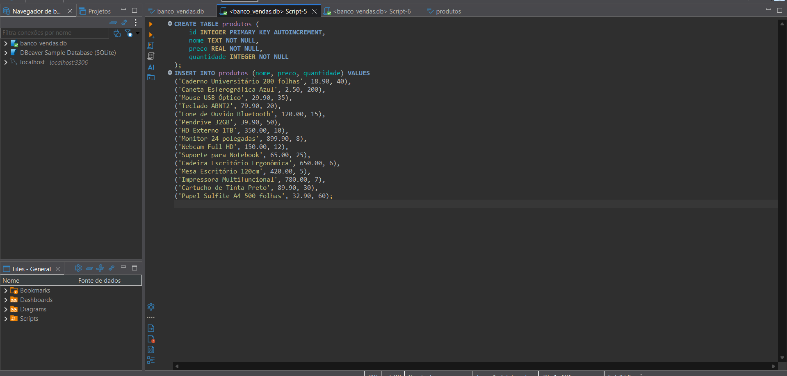

# 🛒 Sales Management System

Sistema de gerenciamento de vendas desenvolvido em **Java + SQLite**, com foco em prática de Programação Orientada a Objetos, JDBC e operações CRUD.

Projeto criado para fins de estudo e composição de portfólio na área de desenvolvimento back-end.

---

## 📌 Funcionalidades

* 📦 Cadastro de produtos
* 📋 Listagem de produtos
* ✏️ Atualização de produtos
* ❌ Exclusão de produtos
* 💰 Registro de vendas
* 📊 Controle de estoque automático
* 🧭 Menu interativo via console

---

## 🛠️ Tecnologias utilizadas

* Java 17+
* JDBC
* SQLite
* DBeaver (gerenciamento do banco)
* VS Code

---

## 🗂️ Estrutura do projeto

```
sales-management-system
│
├── dao
│   ├── ProdutoDAO.java
│   ├── ClienteDAO.java
│   └── VendaDAO.java
│
├── model
│   ├── Produto.java
│   ├── Cliente.java
│   └── Venda.java
│
├── database
│   ├── Conexao.java
│   └── ConexaoSQLite.java
│
├── lib
│   └── sqlite-jdbc-3.51.2.0.jar
│
├── prints
│   ├── print_menu.png
│   ├── print_tabela.png
│   └── print_script_sql.png
│
├── banco_vendas.db
├── Main.java
└── README.md
```

---

## 🧪 Como executar o projeto

1️⃣ Clonar o repositório

```
git clone https://github.com/NathaliaMacielAlmeida/sales-management-system.git
```

2️⃣ Acessar a pasta

```
cd sales-management-system
```

3️⃣ Compilar

```
javac -cp ".;lib/sqlite-jdbc-3.51.2.0.jar" Main.java dao/*.java database/*.java model/*.java
```

4️⃣ Executar

```
java -cp ".;lib/sqlite-jdbc-3.51.2.0.jar" Main
```

---

## 🖥️ Prints do sistema

### Menu interativo


### Tabela de produtos


### Script SQL



---

## 🎯 Objetivo do projeto

Este projeto foi desenvolvido com o objetivo de:

* Praticar lógica de programação
* Aplicar conceitos de POO
* Trabalhar com banco de dados relacional
* Implementar operações CRUD completas
* Simular regras de negócio de vendas

---

## 👩‍💻 Autora

Desenvolvido por **Nathalia Maciel**
Estudante de Sistemas de Informação • Foco em Back-End & Dados

🔗 GitHub:
https://github.com/NathaliaMacielAlmeida

---

## 📌 Melhorias futuras

* Interface gráfica (JavaFX ou Swing)
* Relatórios de vendas
* Dashboard BI
* API REST integrada
* Deploy em nuvem

---
